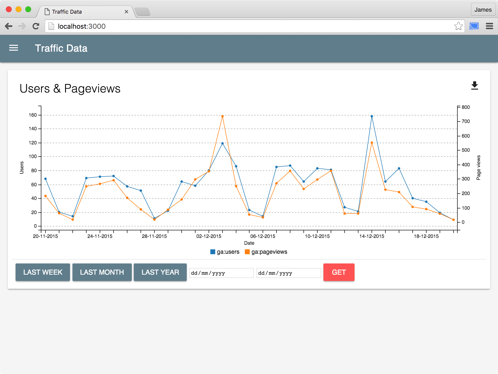
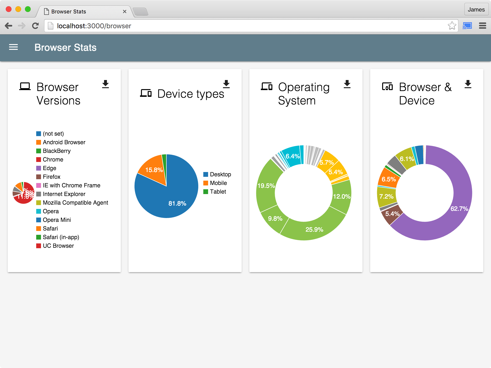
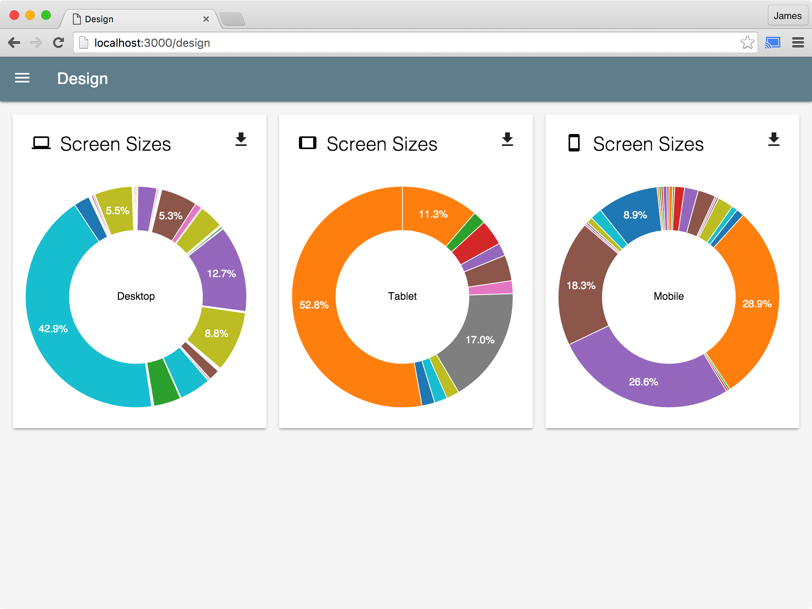

# Dashy 'the board'
An example project combining NodeJS, Connect, Material UI, Google Analytics data API and C3.js.
Displays data taken directly from Google Analytics and renders it as Charts.

# Getting Started
Use `npm start` to run the application, and then access it on `http://localhost:3000`.
Requires a Google Analytics access key file, with the filename `cert.nocrypt.pem` in the root of the project.

# Screenshots

# Todo
- Design appropriateness
- Screen size scatter chart
- Media Queries & percentages of people that see certain views
- Performance stats and budgeting
- Page weight things?
- Top content lists (by URL)
- Inbound traffic stuff
- Maps and traffic
- Icons in charts?
